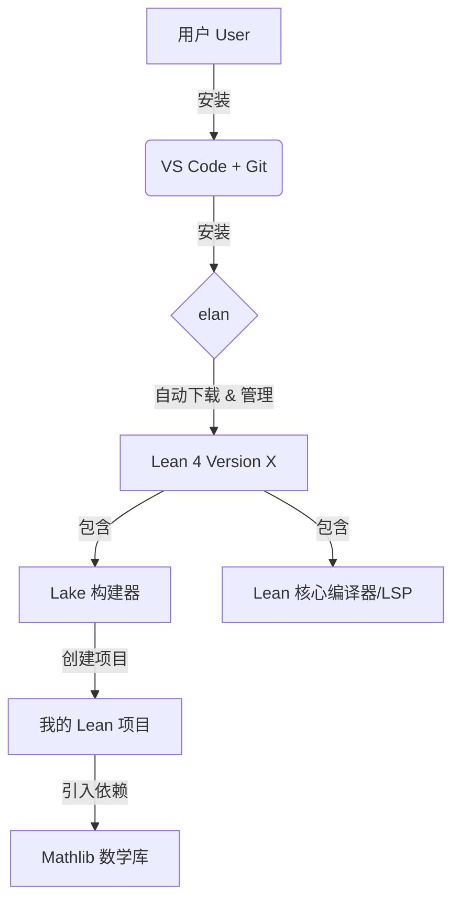
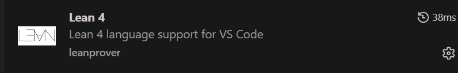
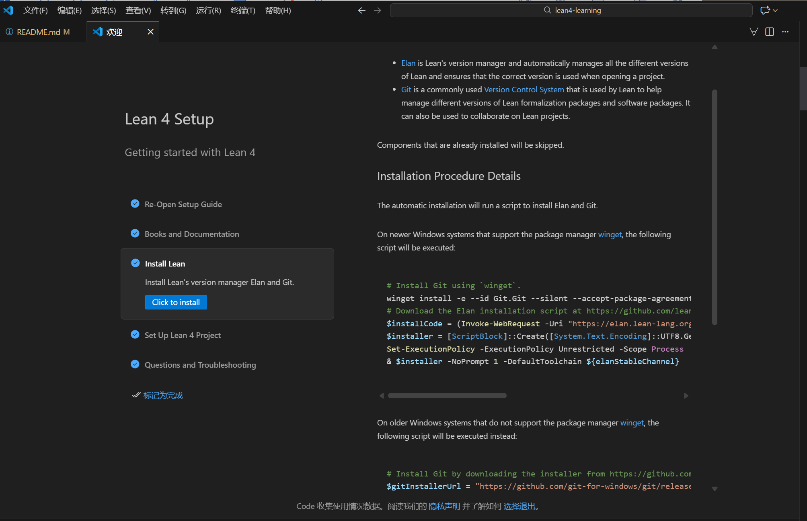
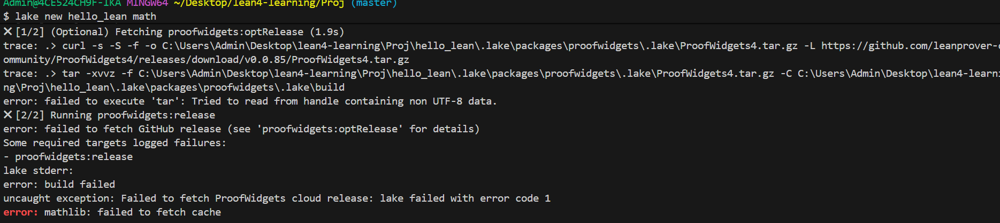
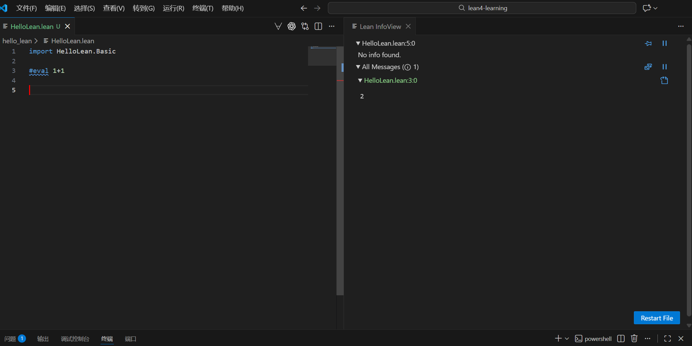

# Lean 4 安装与学习路径（Windows + VS Code）

> 教程地址：https://www.leanprover.cn/Pro

## Lean 的构成

Lean 4 主要由以下几个部分组成：

### VS Code

- 交互界面（The UI）
- 可视化交互：安装 Lean 4 插件后，VS Code 可实时显示证明状态（InfoView）、类型提示和错误检查。

### Git

- 依赖下载：Elan 和 Lake 依赖 Git 从 GitHub 下载不同版本的 Lean 及项目依赖（如 Mathlib）。

### Elan

- 主机上的版本管理器。
- 每个项目都可以指定使用的 Lean 版本，Elan 负责在同一台机器上安装和管理多个版本。
- 自动切换：打开项目时，Elan 会读取项目根目录下的 lean-toolchain 文件并自动激活所需版本，确保兼容性。
- 安装代理：用户通过安装 Elan 间接安装 Lean 编译器和构建工具。

### Lake

- 项目构建工具，管理 Lean 项目的依赖和构建过程。
- 依赖管理：Lake 解析依赖关系，下载并安装所需的 Lean 包，例如 Mathlib。
- 编译构建：负责编译 Lean 代码、构建库文件或生成可执行二进制文件。

### Lean

- 语言核心组件，包含 Lean 编译器和标准库。

### Mathlib

- Lean 的数学库，提供了大量的数学定义、定理和证明，供用户在 Lean 中调用。


### 构建流程图
用户的安装与使用流程如下：



## 安装步骤

### 安装 VS Code 和 Git

**下载 VS Code 插件**


**插件设置 lean4setup**
进入插件设置界面，跟着提示设置。你可以在 installLean 这里选择安装 elan，或者也可以手动安装 elan。


### 安装 Elan

手动安装 Elan：

打开 PowerShell（以管理员身份运行），执行以下脚本：

```powershell
try {
  $installCode = (Invoke-WebRequest -Uri 'https://elan.lean-lang.org/elan-init.ps1' -UseBasicParsing -ErrorAction Stop).Content
  $installer = [ScriptBlock]::Create([System.Text.Encoding]::UTF8.GetString($installCode))
  Set-ExecutionPolicy -ExecutionPolicy Unrestricted -Scope Process
  $rc = & $installer -NoPrompt 1 -DefaultToolchain leanprover/lean4:stable
  exit $rc
} catch {
  Write-Host 'Downloading and running the Elan installer failed.'
  Write-Host $_
  exit 1
}
```

重启终端并输入 `elan --version`。如果能正常输出版本号，说明 Elan 与 Lean 4 stable 版本已安装完成。

进一步验证（可选）：

为确保 Elan 能正常为 Lean 4 服务，你还可以执行以下命令做完整验证：

检查 Elan 是否能识别 Lean 4 工具链：
```powershell
elan toolchain list
```
如果输出中有 leanprover/lean4:stable 这类条目，说明工具链已配置。
如果提示 “no toolchains installed”，可手动安装稳定版工具链：
```powershell
elan default leanprover/lean4:stable
```
验证 Lean 4 是否能正常调用：
```powershell
lean --version
```
若返回类似 `Lean (version 4.x.x, ...)` 的信息，说明 Elan 已成功关联 Lean 4，整个环境搭建完成。

### Elan 常用命令

```powershell
elan --version   # 输出版本号，测试安装是否成功
elan self update # 更新 elan
elan show        # 显示已安装的 Lean 版本

# 下载指定 Lean 版本，所有版本可见 https://github.com/leanprover/lean4/releases
elan install leanprover/lean4:v4.10.0

# 下载最新稳定版本 stable
elan default leanprover/lean4:stable

# 切换默认的 Lean 版本
# 切换到 leanprover/lean4:v4.11.0-rc1
elan default leanprover/lean4:v4.11.0-rc1

# 设置在当前目录下使用的 Lean 版本
elan override set leanprover/lean4:stable
# info: info: override toolchain for 'xxx' set to 'leanprover/lean4:stable'
lake --version # 使用 elan 默认版本
# 使用指定版本
elan run leanprover/lean4:v4.10.0 lake --version
elan run leanprover/lean4:v4.10.0 lean --version
# 创建指定版本的项目
elan run leanprover/lean4:v4.10.0 lake new package

```

### 创建第一个 Lean 项目

在你想创建项目的目录下打开终端，执行以下命令：
```powershell
lake new my_first_lean_project math
```
这会创建一个名为 my_first_lean_project 的新目录，里面包含一个基本的 Lean 项目结构。

这一步会自动为你生成一个包含 Mathlib 依赖的 Lean 项目模板。如果不需要 Mathlib，可以将 math 去掉。

带有 `math` 参数的命令会自动下载并安装 Mathlib 依赖，可能需要一些时间，取决于你的网络速度。

在这里可能会有一个问题：

> 你在 Lean 4 项目中拉取 Mathlib 和 ProofWidgets 时遇到了构建失败的问题，核心原因是 Windows 系统下的 tar 命令不兼容（提示 “non UTF-8 data”），导致 ProofWidgets 的预编译包解压失败，进而触发整个构建流程报错。

一个解决方案是用 Git Bash 替代默认的 Windows 命令行工具，因为 Git Bash 自带的 tar 命令能够正确处理这些压缩包。

- 关闭当前 PowerShell 窗口，打开 Git Bash（在开始菜单搜索 Git Bash）。
- 进入你的 Lean 项目目录。
- 重新执行触发构建的命令（比如拉取 Mathlib 或构建项目）：
  - lake update  # 更新依赖
  - lake exe cache get # 获取预编译包
  - lake build   # 重新构建

如果你看到终端中显示了类似如下的提示：

```powershell
Decompressing 1234 file(s)
unpacked in 12345 ms
```

同时你的项目文件夹中出现了 `.lake\packages` 文件夹，说明 Mathlib 已安装成功，此时点击 “Restart Lean” 即可使用。注意：要在项目所在目录中运行 VS Code，Lean 才能加载 Mathlib。
#### lake exe cache get

这里解释一下 `lake exe cache get` 命令的作用：

这是一个常见痛点，答案稍复杂，分为 **“硬盘占用”** 和 **“下载流量/时间”** 两个方面来看。

简单直接的回答是：**是的，你的硬盘里会有多份 Mathlib，但你不必每次都从头编译，也不一定每次都要从互联网下载。**

以下是详细的情况分析：

##### 1. 源码与文件结构：隔离的（Per-Project）

**现状：**
Lean 4（Lake）采用类似 Node.js (`node_modules`) 的策略，而不是 Java Maven 那种全局唯一的仓库。
当你建立一个新项目（比如 `Project A`）并添加 Mathlib 依赖时，Lake 会把 Mathlib 的源码 **克隆（Git Clone）** 到当前项目的 `.lake/packages/mathlib` 目录下。

* **硬盘：** 哪怕 `Project A` 和 `Project B` 用的是同一个版本的 Mathlib，你的硬盘上也会有两份完整的 Mathlib 源码。
* **原因：** 这样做是为了保证“依赖隔离”。如果 `Project A` 魔改了 Mathlib 的某一部分，不会影响到 `Project B`。

##### 2. 编译产物（Oleans）：使用云端缓存（The Cloud Cache）

**这是最重要的部分。** Mathlib 非常巨大，如果从源码从头编译（Build from source），在一台普通电脑上可能需要 **1 到 3 个小时**。你肯定不想每个新项目都经历一次。

Lean 社区提供了一套 **云端缓存机制**：

1. 当你运行 `lake exe cache get` 时。
2. 工具会检查你当前依赖的 Mathlib 版本的“哈希值”。
3. 它会直接从 Azure 服务器下载**已经编译好的二进制文件**（.olean 文件）。
4. 解压到你的项目里。

**结果：** 你不需要编译几小时，只需要下载几分钟（取决于网速）。

##### 3. 本地全局缓存（Local Global Cache）

**好消息是：** 缓存工具（`cache`）比 Lake 聪明一点。

如果你建立了 `Project A`，下载了 Mathlib `v4.10.0` 的编译缓存，然后又建立了 `Project B`，也使用 Mathlib `v4.10.0`。

当你运行 `lake exe cache get` 时：

1. 它会先去你电脑的 **全局缓存目录**（通常在 `~/.cache/mathlib` 或类似路径）查找。
2. 如果找到了对应的版本，它就**直接从本地复制**过去，而不需要再从互联网下载了。

---

##### 总结：实际体验是怎样的？

当你创建一个新项目时，会发生以下情况：

1. **Git Clone 阶段（必需）：** Lake 会从 GitHub 拉取 Mathlib 的源码配置。这需要联网，每次都要做（除非你手动复制文件夹）。
2. **获取缓存阶段（必需）：** 运行 `lake exe cache get`。
  * **情况 A（版本相同）：** 如果你之前下过这个版本的 Mathlib，它是**秒级**完成的（本地复制）。
  * **情况 B（版本更新）：** 如果 Mathlib 更新了（它更新非常频繁，甚至每天都在变），你需要从互联网下载新的预编译包（大约几百 MB）。


##### 给你的建议

为了让体验更丝滑，建议遵循以下流程：

1. **创建项目时使用模板：**
不要只用 `lake new`，要用：
```bash
lake new my_project math

```


*(加上 `math` 参数会自动帮你配置好 Mathlib 的依赖文件，省去手写的麻烦)*
2. **标准起手式：**
每次建立新项目或更新依赖后，**立刻**运行：
```bash
lake exe cache get
lake build

```


*不要直接 `lake build`，否则它会试图从源码编译，你的电脑风扇会起飞，并且要等很久。*
3. **关于硬盘空间：**
Mathlib 很大（包含编译产物可能占用 1GB+）。如果你有很多测试项目，记得定期清理不再使用的旧项目文件夹，否则硬盘很快会满。

#### 运行项目

如果一切顺利，`lake build` 不会报错，或者只会输出一些警告（Warning），最后安静结束。

如果 `lake build` 成功了，你就可以用 VS Code 打开 `hello_lean` 文件夹：

然后打开 HelloLean.lean 文件，输入 `#eval 1+1`，如果看到 2，恭喜你，环境配置大功告成！


### 交互式证明
Lean 4 通过 VS Code 插件提供了强大的交互式证明环境。



这张截图代表了你配置环境的彻底胜利！🎉

你现在看到的界面是 VS Code 配合 Lean 4 插件的标准工作形态。不同于 C++ 或 Java 需要“写代码 -> 编译 -> 运行 -> 看终端”，Lean 是一种交互式体验。

让我为你拆解屏幕上每一部分的含义：

1. 左侧：代码编辑区（Editor）
这里是你写“指令”给 Lean 编译器的地方。

第 1 行：`import HelloLean.Basic`

作用：这相当于 Python 的 import 或 C++ 的 #include。

含义：它告诉 Lean：“先把 HelloLean/Basic.lean 这个文件里的东西读进来”。因为你用的是模板，Basic.lean 通常是自动生成的（可能是空的或者只有基础定义），用来组织代码结构。

第 3 行：`#eval 1+1`

作用：这是 Lean 的命令（Command）。

#eval：意思是“Evaluate（计算）”。它让编译器立刻算出后面表达式的值。

蓝色的波浪线：注意看 #eval 下面有蓝线，这不是报错。它表示 InfoView（右侧窗口）正在显示这一行代码的结果。

2. 右侧：Lean InfoView（信息视图）
这是 Lean 最强大的地方，它是你的实时反馈面板。它不是一个静态的终端，而是一个随光标变化的动态窗口。

▼ All Messages (1)：表示当前有一个信息输出。

▼ HelloLean.lean:3:0：

这表示信息的来源位置：第 3 行，第 0 列。

正好对应左边的 `#eval 1+1`。

2：

这就是 1+1 的计算结果。

即时性：你可以试着把左边的 `1+1` 改成 `100*100`，右边的数字会瞬间变成 10000，不需要你点保存或运行按钮。

3. 核心概念：交互式编程
为了让你更好地理解这个界面的“魔力”，请注意以下几点：

光标驱动：Lean InfoView 的内容通常取决于你的光标在哪里。如果你把光标移到第 1 行，右边的 2 可能会消失（因为它只显示当前关注点的信息）。

实时检查：如果你写了一个错误的证明或代码，右侧会立刻显示红色的 Error，左侧代码也会变红。

不仅仅是计算器：虽然 `#eval` 看起来像计算器，但 Lean 的主要工作是“证明”。以后你在写数学证明时，右侧窗口会显示 **“当前的数学目标（Tactic State）”**，告诉你还需要证明什么。

我可以为你做的下一步
既然环境已经完美工作，我们要不要试着写一个最简单的数学证明（而不是计算）？

请在 `#eval 1+1` 的下面，输入以下代码，看看右侧 InfoView 会发生什么变化：

```lean
-- 这是一个简单的定理：证明 1 加 1 等于 2
example : 1 + 1 = 2 := by
  rfl
```
（输入后，把光标放在 `rfl` 这一行，观察右侧的变化。）

你不需要像写 Python 或 C++ 那样先写完代码，然后按“运行”，再等结果。在 Lean 里，写代码的过程就是验证的过程。

怎么判断证明成功了？
你不需要看终端输出，只需要看右边的 Lean InfoView。

1. 成功的标志："No goals"
当你写完证明的最后一步，如果逻辑是正确的，右边的 InfoView 会显示一句话：

No goals（或显示 “Goals accomplished” 🎉）

这意味着：“没有剩下的目标了（你已经证明完了一切）”。 同时，代码里的红色波浪线会全部消失。

2. 失败/未完成的标志
如果你的逻辑卡住了，或者还没写完，InfoView 会显示：

`1 goal ⊢ 1 + 1 = 2`

这意思是：“还有一个目标没完成，你需要证明 1+1=2”。

动手体验一下“实时反馈”
请把下面这段代码复制到你的 VS Code 里，然后按照我的说明移动光标，感受一下这种“活”的感觉：

```lean
example : 1 + 1 = 2 := by
  rfl
```
实验步骤：

把光标放在 `by` 后面（不要选中 `rfl`，或者把 `rfl` 删掉）：

你会看到右边 InfoView 显示 1 goal。

它在对你说：“嘿，我还在等你证明 1+1=2 呢”。

把 `rfl` 写回去，或者把光标移到 `rfl` 这一行：

你会看到右边瞬间变成了 No goals。

它在对你说：“干得漂亮，证明结束！”

搞点破坏：

把 2 改成 3（变成 `example : 1 + 1 = 3 := by`）。

此时即使你写了 rfl，代码也会立刻变红。

InfoView 会报错，提示 `rfl` 失败，因为 1+1 不等于 3。

总结
这就是 Lean 开发者的日常： 盯着右边的窗口，像玩俄罗斯方块一样，一步步消除所有的 "goals"，直到出现 "No goals"，然后就可以开心地下班了。

